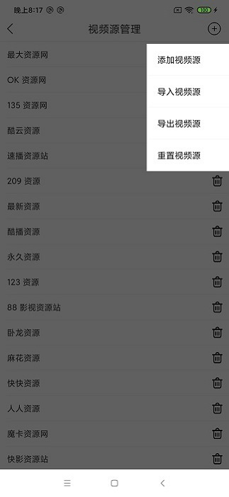

## ZY Player Android 资源播放器

基于[ZY-Player](https://github.com/Hunlongyu/ZY-Player)开发的Android版本视频播放器

### 下載

- [百度网盘下载](https://pan.baidu.com/s/1fV1rO-WAcqbf0NBIgm1NsA)，提取码: py2s
- [蓝奏云下载](https://wws.lanzous.com/b01nmvjvi)，提取码: 1wyh

### 截图

|           首页            |            收藏             |
| :-------------------------------: | :-------------------------------: |
|   |  |
| 我的 | 详情 |
|  |  |
| 搜索 | 视频源管理 |
|  |  |

### 版本记录

#### v2.5.1

- 增加影片信息
- 去除启动页广告，增加搜索结果页广告

#### v2.5.0

- 投屏功能

#### v2.4.7

- 报毒的问题

#### v2.4.6

- 设置回来了
- 密码锁

#### v2.4.5

- 首页变成了一行三列
- 增加了简易的iptv模块（视频源来自[zy_client_android](https://github.com/javakam/zy_client_android)）
- 加了点广告

#### v2.4.4

- “青少年模式”改为“关键词过滤”
- 解析接口兼容
- 选集支持单双列切换
- 本地导入提示“解析异常，请检查”问题修复
- 清除了一些没用的权限

#### v2.4.3

- App字体大小不受系统字体影响
- 选集优化
- 修复首页视频不更新的问题
- 播放历史支持删除全部，增加播放进度，修复保存记录异常的bug
- 视频源可用性检测
- 支持清除缓存

#### v2.4.2

- 播放历史功能
- 支持前进后退15s
- 重复视频源筛除（名字或api相同）
- 视频源管理增强（置顶、全网搜开关、删除全部）
- 增加解析api
- 其他体验优化

#### v2.4.1

- 支持视频源拖拽排序
- 支持视频源网络导入
- 支持单个视频源修改

#### v2.4.0

- 支持视频源管理

#### v2.3.3

- 修复自动播放下一集时屏幕常亮失效的bug
- 优化搜索页的键盘消失

#### v2.3.2

- 修复自动播放下一集时屏幕常亮失效的bug
- 支持亮度调节
- 筛除无数据tab

#### v2.3.1

- 修复崩溃问题
- 支持外部播放器播放

#### v2.3.0

- 全屏模式支持选集、上下集
- 支持全网搜
- 增加省钱专区

#### v2.2.0

- 播放器换回了GSYVideoPlayer，使用exo内核
- 支持倍速播放
- 支持画面比例拉伸
- 默认屏蔽福利tab，设置中可打开

#### v2.1.1

- 数据解析bug修复，某些搜不到的资源又能搜到啦

#### v2.1.0

- 更改播放器为JZVideo

#### v2.0.0

- 新版ui和数据解析
- 收藏
- 搜索历史
- 问题反馈

#### v1.0.2

- 修复8.0设备无法启动应用的问题
- 支持外部下载视频
- 加载异常页支持跳转源网址

#### v1.0.1

- 应用内升级
- 崩溃上报

#### v1.0.0

- 视频搜索（12个视频源）
- 详情页
- 视频播放
- 外部浏览器播放

### 重要:

所有资源来自网上, 该软件不参与任何制作, 上传, 储存, 下载等内容. 该软件仅供学习参考, 请于安装后24小时内删除.
