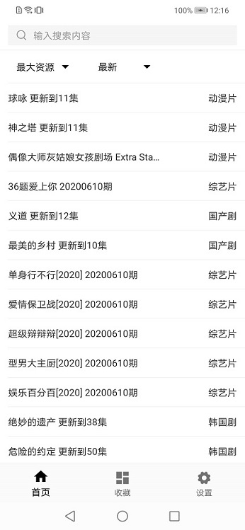
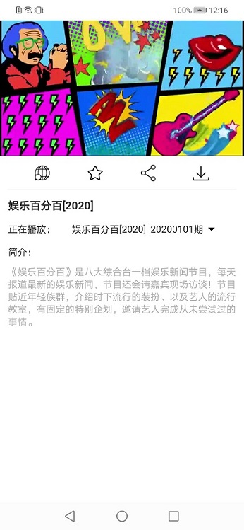
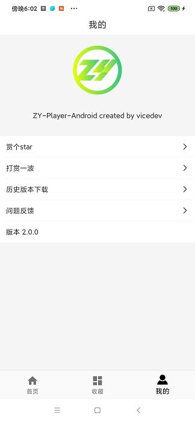
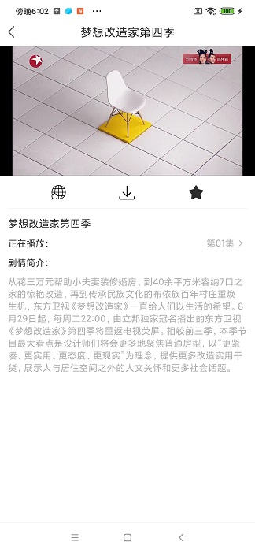
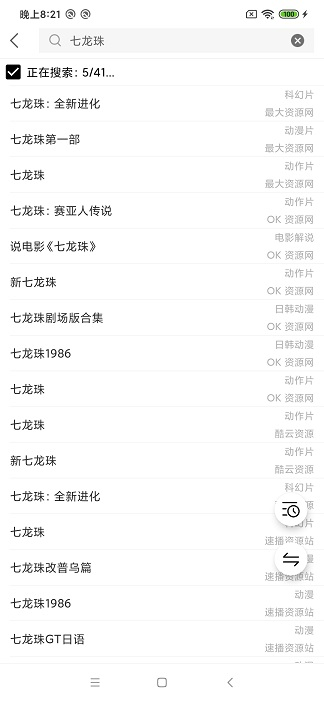

## ZY Player Android 资源播放器

基于[ZY-Player](https://github.com/Hunlongyu/ZY-Player)开发的Android版本视频播放器

### 下載

- [百度网盘下载](https://pan.baidu.com/s/1fV1rO-WAcqbf0NBIgm1NsA)，提取码: py2s
- [蓝奏云下载](https://wws.lanzous.com/b01nmvjvi)，提取码: 1wyh

### 截图

|           首页            |            收藏             |
| :-------------------------------: | :-------------------------------: |
|   |  |
| 我的 | 详情 |
|  |  |
| 搜索 |  |
|  |  |

### TODO 

- 视频下载（应用内）
- 详情页展示优化
- 美化界面
- 视频分享
- 多主题
- 多语言
- 投屏
- 播放历史
- 数据时间顺序排序
- 拉起外部播放器播放
- 支持导入源

### 版本记录

#### v2.3.0

- 全屏模式支持选集、上下集
- 支持全网搜
- 增加省钱专区

#### v2.2.0

- 播放器换回了GSYVideoPlayer，使用exo内核
- 支持倍速播放
- 支持画面比例拉伸
- 默认屏蔽福利tab，设置中可打开

#### v2.1.1

- 数据解析bug修复，某些搜不到的资源又能搜到啦

#### v2.1.0

- 更改播放器为JZVideo

#### v2.0.0

- 新版ui和数据解析
- 收藏
- 搜索历史
- 问题反馈

#### v1.0.2

- 修复8.0设备无法启动应用的问题
- 支持外部下载视频
- 加载异常页支持跳转源网址

#### v1.0.1

- 应用内升级
- 崩溃上报

#### v1.0.0

- 视频搜索（12个视频源）
- 详情页
- 视频播放
- 外部浏览器播放

### 重要:

所有资源来自网上, 该软件不参与任何制作, 上传, 储存, 下载等内容. 该软件仅供学习参考, 请于安装后24小时内删除.
